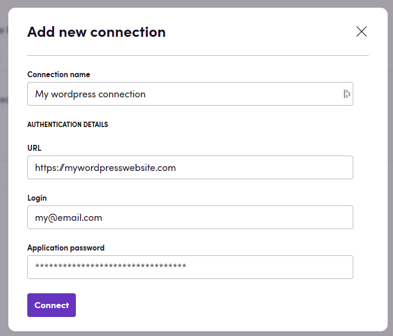

# Blackbird.io Wordpress (+ Polylang)

Blackbird is the new automation backbone for the language technology industry. Blackbird provides enterprise-scale automation and orchestration with a simple no-code/low-code platform. Blackbird enables ambitious organizations to identify, vet and automate as many processes as possible. Not just localization workflows, but any business and IT process. This repository represents an application that is deployable on Blackbird and usable inside the workflow editor.

## Introduction

<!-- begin docs -->

Wordpress is the world's most popular website builder. This app allows you to connect your Wordpress website to Blackbird and build automated content repurposing and translation workflows. Wordpress doesn't natively come with localization features. That's why this app supports the popular [Polylang pro](https://polylang.pro/downloads/polylang-pro/) plugin. All affected actions and fields are demarkated with (P) if they require this plugin to work.

## Before setting up

Before you can connect you need to make sure that:

- You have administrator access to a Wordpress environment.
- You have created an application password. You can do this in your Wordpress admin panel -> Users -> Profile. At the bottom of this page you can find _Application Passwords_. Give your new password a name and click _Add New Application Password_. Save the password that appears.
- Optionally, if you want to use the localization features, make sure that [Polylang pro](https://polylang.pro/downloads/polylang-pro/) is installed.

## Connecting

1. Navigate to apps and search for Wordpress. If you cannot find Wordpress then click _Add App_ in the top right corner, select Wordpress and add the app to your Blackbird environment.
2. Click _Add Connection_.
3. Name your connection for future reference e.g. 'My new Wordpress connection'.
4. Fill in the URL of your Wordpress website.
5. Fill in the email you use to login to your Wordpress admin account under _Login_.
6. Fill in the application password you created previously.
7. Click _Connect_.

## Actions

### Posts & pages

The following actions are applicable to both posts and pages. For convenience both are from now on refered to as posts.

- **Search** posts given created or updated times. Optionally use the language input to filter by language (with Polylang).
- **Get** returns all the post's information.
- **Get missing translations (P)** returns a list of languages that the post is not translated in. Polylang required.
- **Get translation (P)** returns the post that is the translation of the selected post, given the language. Polylang required.
- **Get as HTML** returns the post in HTML format, useful for translating the entire post page as a single unit.
- **Delete** deletes the post

All create and update actions optionally take a language and "as translation of" input. Both are used by Polylang to assign the correct languages and relationships with other posts.

- **Create** a new post
- **Create from HTML** creates a new post given an HTML file as input.
- **Update** a post
- **Update from HTML** updates a post given an HTML file as input.

### Comments

- **Add comment**
- **Delete comment**

### Media

- **Get all media**
- **Get media**
- **Upload media**
- **Delete media**

### Users

- **Get all users**
- **Get user**
- **Add user**

### Other

- **Get languages (P)** returns all languages configured and their additional information. Polylang required.

### Missing features

In the future we will add actions for:

- Blocks
- Categories
- Navigations
- Menus
- Revisions
- Tags

Our post & page actions can also be extended to deal with more properties like status, dates, etc.

Let us know if you're interested!

## Events

- **On posts created** triggers when new posts are created.
- **On posts updated** triggers when any posts are updated.
- **On pages created** triggers when new pages are created.
- **On pages updated** triggers when any pages are updated.

## Feedback

Do you want to use this app or do you have feedback on our implementation? Reach out to us using the [established channels](https://www.blackbird.io/) or create an issue.

<!-- end docs -->
